# Project: Web Application Security: WAF Deployment & SIEM Integration

## Project Overview

This project demonstrates the deployment of a Web Application Firewall (WAF) to protect a vulnerable web application, the engineering of a custom log extraction pipeline to bypass container isolation, multi-vector penetration testing, and the validation of multi-layer detection rules in a centralized SIEM environment.

---

## Resume Bullets

- **Deployed SafeLine Community Edition WAF** (192.168.9.136:9443) protecting DVWA in Docker; configured reverse proxy, SSL termination, and rate-limiting policies
- **Built custom log extraction pipeline** to bypass SafeLine container isolation; extracted PostgreSQL logs via docker exec, formatted for Syslog CEF, and automated UDP forwarding to Security Onion (192.168.9.128:514) on a cron schedule
- **Integrated Syslog pipeline** from SafeLine WAF → Security Onion SOC; parsed and indexed attack logs in Elastic for real-time analysis
- **Executed multi-vector penetration tests**: SQL Injection, Cross-Site Scripting (XSS), Command Injection (`cat /etc/passwd`), and Local File Inclusion (LFI) attacks with manual curl/ZAP tooling
- **Engineered detection rules** in Suricata (ET WEB_SERVER Script tag ruleset) and Elastic (HTTP response code analysis) to identify attack payloads and WAF defensive actions
- **Validated rate-limiting defense** by configuring access policies (3 requests/10 seconds) and confirming 403 Forbidden blocks in both WAF logs and SIEM dashboards

---

## Architecture & Infrastructure

The environment was built to simulate a production network path:
- **Attacker**: Kali Linux VM (192.168.9.130)
- **Edge Security / Proxy**: SafeLine Community Edition WAF (192.168.9.136:9443)
- **Target Application**: DVWA running in a Docker container (172.17.x.x:80)
- **Centralized SOC**: Security Onion (192.168.9.128:514)

Traffic flow: Kali requests hit the SafeLine WAF reverse proxy. SafeLine inspects the payloads against its signature and rate-limiting engines. Legitimate traffic is forwarded to the internal DVWA container. Log telemetry is shipped to Security Onion for IDS and SIEM correlation.

---

## Phase 1: WAF Deployment & Access Control

SafeLine was deployed as the primary defense layer. The listener was bound to port 9443 with SSL termination enabled. The reverse proxy was configured to route traffic exclusively to the isolated DVWA backend.

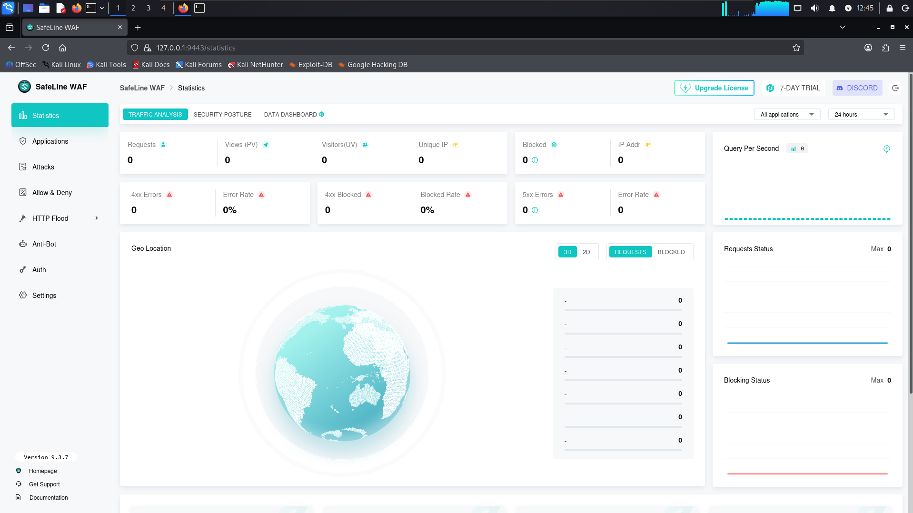
*SafeLine listener operational and tracking inbound traffic.*

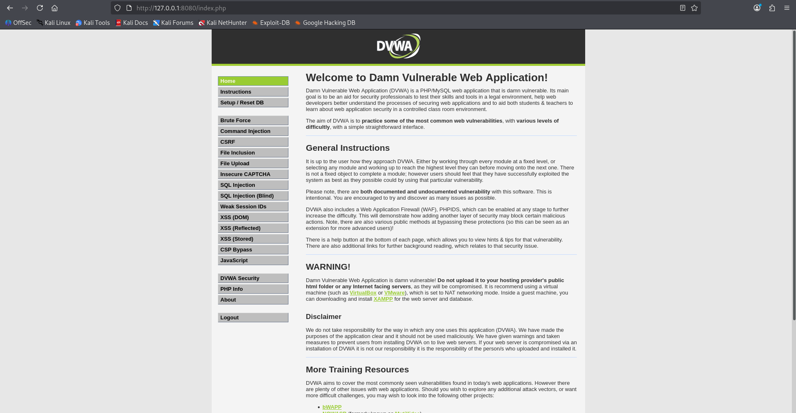
*Successful login to DVWA through the SafeLine proxy.*

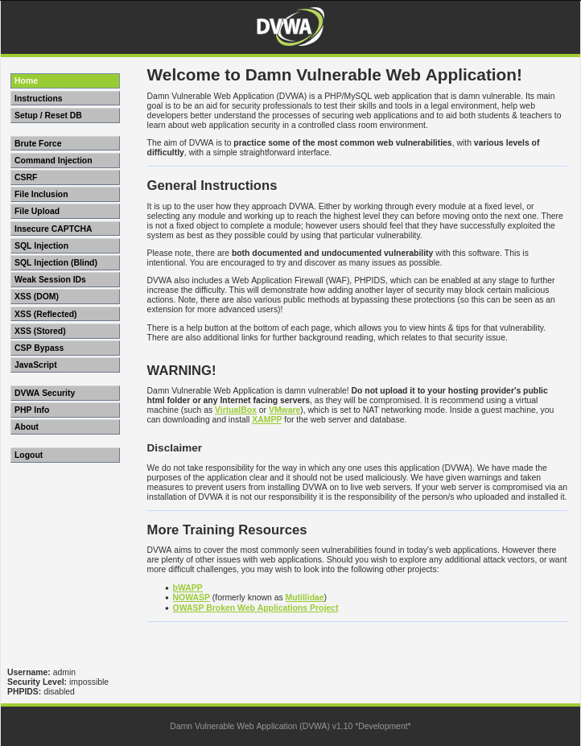
*DVWA login interface accessible only through the WAF proxy.*

---

## Phase 2: Engineering the Custom Log Extraction Pipeline

SafeLine's native Syslog forwarding feature exported CEF headers but trapped the actual attack payloads, source IPs, and specific HTTP response codes inside a local PostgreSQL database running within the `safeline-pg` Docker container.

To achieve full SOC visibility, a custom extraction pipeline was built:

1. **Extraction via Docker Exec**: `docker exec` was used to pass a direct query to the PostgreSQL database (`public.mgt_detect_log_basic`) inside the running container.
2. **Data Parsing**: Raw `attack_type`, `src_ip`, and `url_path` were extracted for every logged event.
3. **Standardization**: The raw data was mapped into the Common Event Format (CEF) standard so Security Onion could parse it natively.
4. **Transport**: The CEF-formatted strings were piped through `nc` (netcat) via UDP port 514 directly to the Security Onion ingest node.
5. **Automation**: The script was bound to a cron job, executing every 60 seconds to maintain near real-time SOC visibility.

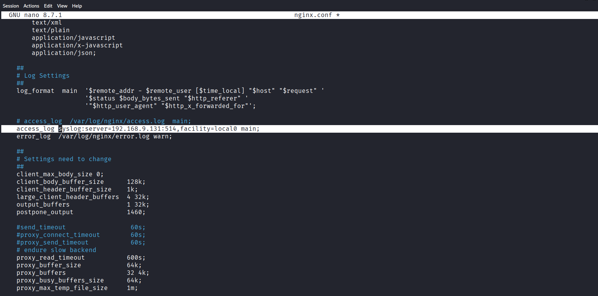
*SafeLine Syslog destination settings pointing to Security Onion.*

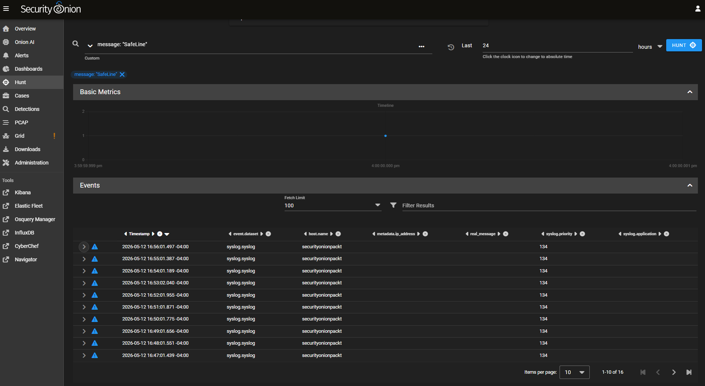
*Security Onion Kibana interface confirming the successful ingestion of custom CEF-formatted logs via UDP.*

---

## Phase 3: Manual Penetration Testing & Signature Validation

With the pipeline actively shipping logs, manual attacks were executed using `curl` to validate the WAF's signature detection engine.

- **SQL Injection (SQLi)**: Injected `1' OR '1'='1`
- **Cross-Site Scripting (XSS)**: Injected ``
- **Command Injection**: Injected `; cat /etc/passwd`
- **Local File Inclusion (LFI)**: Injected `../../../etc/passwd`

SafeLine's detection engine successfully identified the payload structures, blocked the malicious requests, and wrote the attack codes to the database. The custom pipeline immediately shipped these logs to the SOC.

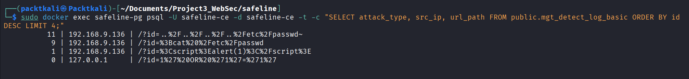
*SafeLine categorizing the exact attack vectors injected.*

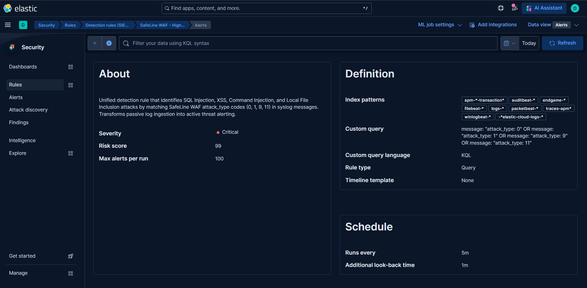
*Confirmation of the WAF rule matching engine engaging against the payloads.*

---

## Phase 4: ZAP Automation and Tactical Pivot to Manual Testing

An automated OWASP ZAP scan was launched against the proxy to test SafeLine under heavy load. ZAP began fuzzing the application with thousands of payloads simultaneously.

The rapid fuzzing consumed all available RAM on the Kali VM (4GB), causing a hard freeze of the attacker machine. The sheer volume of requests also obscured the ability to precisely track when the WAF's rate-limiting engaged.

A tactical pivot was made to a custom manual Bash loop. A script was written to fire exactly 10 `curl` requests with a hardcoded 2-second sleep between each request.

SafeLine was configured to block IPs that sent more than 3 requests within a 10-second window. By running the manual loop, the exact moment the threshold was crossed was observed:
- Requests 1, 2, and 3: Returned `200 OK`
- Request 4 (crossing the 10-second threshold): Returned `403 Forbidden`
- Requests 5 through 10: Returned `403 Forbidden`

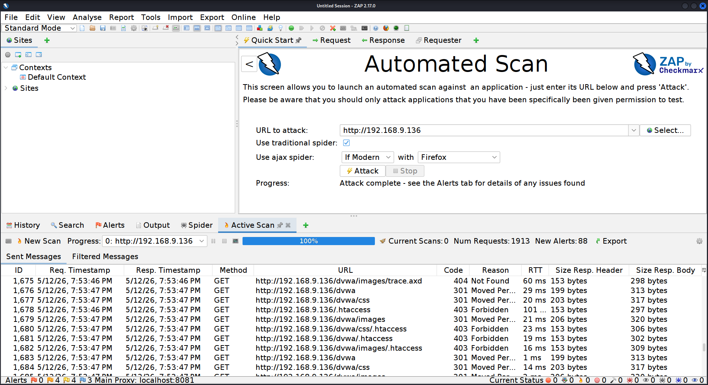
*The initial ZAP automated scan traffic prior to the Kali memory exhaustion.*

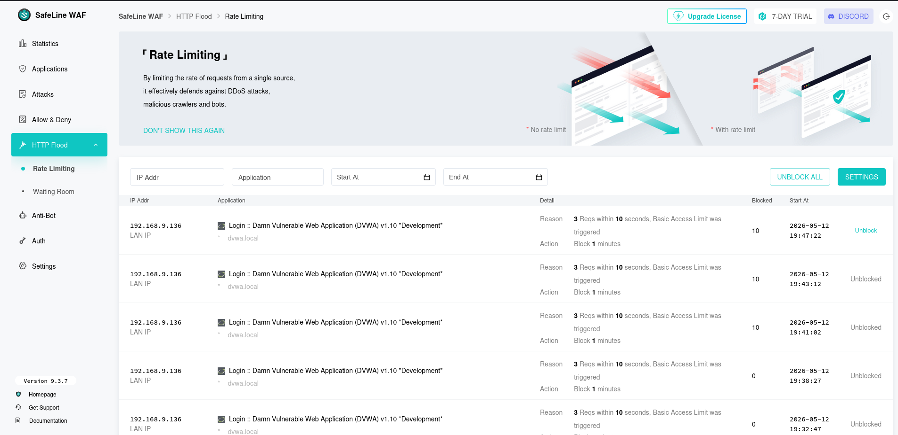
*The 403 Forbidden blocks triggered during the controlled rate-limiting validation loop.*

---

## Phase 5: Multi-Layer Detection Correlation in the SOC

### Suricata Network IDS

The Hunt interface was queried for `message: *XSS*`. Suricata successfully caught the `<script>` tags at the network packet level, triggering the `ET WEB_SERVER Script tag in URI` signature. This proved that even if the WAF logging failed, the network sensor caught the intrusion.

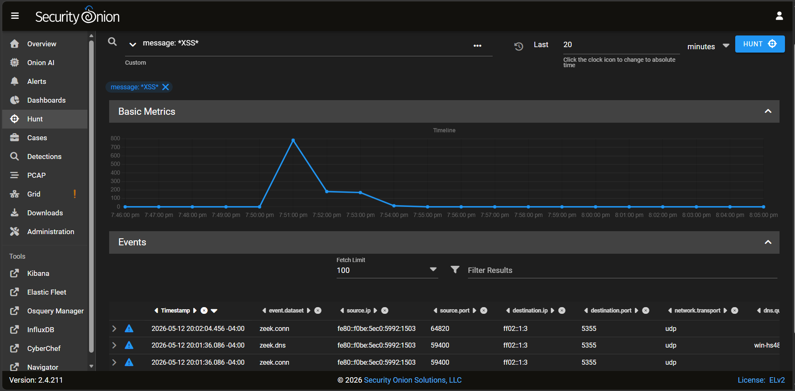
*Suricata firing on the XSS payload independent of SafeLine's application-layer inspection.*

### Elastic HTTP Response Analysis

Elastic was queried for `event.outcome: "success"`. This allowed correlation of successful `200 OK` traffic alongside the `403 Forbidden` blocks. Legitimate traffic was actively monitored and permitted, while rate-limiting blocks were surgical and didn't result in a complete denial of service for standard requests.

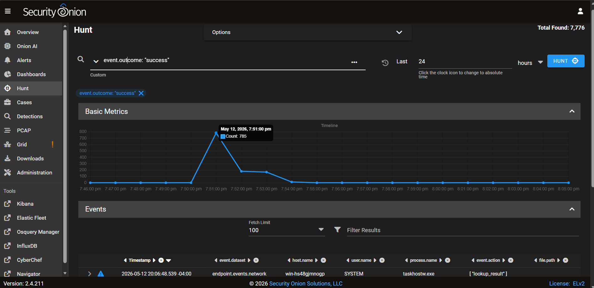
*Elastic dashboard validating the ratio of successful traffic versus blocked attacks.*

---

## Key Takeaways

1. **Custom Log Pipelines**: When native integrations don't provide full visibility, building custom extraction solutions using tools like `docker exec`, CEF formatting, and UDP transport ensures complete telemetry reaches the SIEM.
2. **Controlled Testing**: Automated fuzzers can obscure threshold behavior. Manual Bash loops provide granular, deterministic validation of security controls like rate-limiting.
3. **Defense in Depth**: Detection was achieved at the WAF level (SafeLine), the Network level (Suricata), and the Correlation level (Elastic).

---

## Files & Artifacts

- **screenshots/**: Evidence images (11 total)
  - 01_SafeLine_WAF_Dashboard_Active.png
  - 02_DVWA_Login_Success.png
  - 03_DVWA_Protected_via_SafeLine_WAF.png
  - 04_SafeLine_Syslog_Configuration.png
  - 05_Security_Onion_Syslog_Reception.png
  - 06_SafeLine_Attack_Codes_Extraction.png
  - 07_SafeLine_Detection_Rule_Active.png
  - 08a_ZAP_Fuzzer_Traffic.png
  - 08b_WAF_Rate_Limiting_Backend.png
  - 09_Suricata_XSS_Alert.png
  - 10_HTTP_Success_Validation.png

---

## Author

**David Mokom** | SOC Analyst & Cybersecurity Professional 
Date: May 2026

---

## License

Educational use only. DVWA is licensed under GPLv3. SafeLine is open-source under FOSS license.
