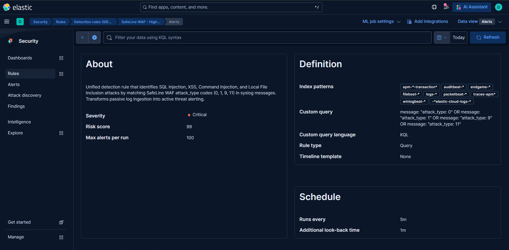
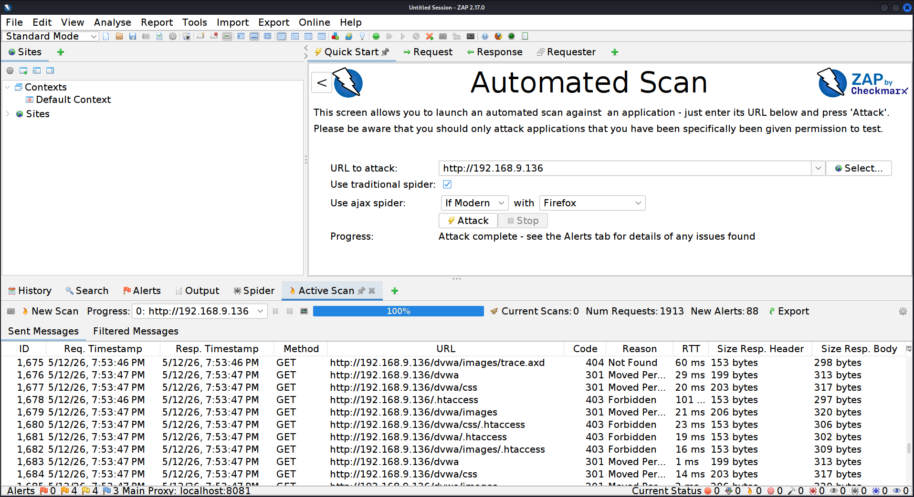
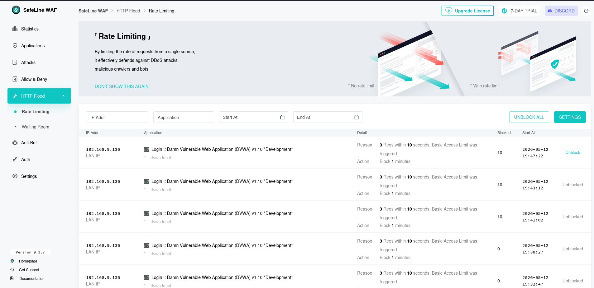
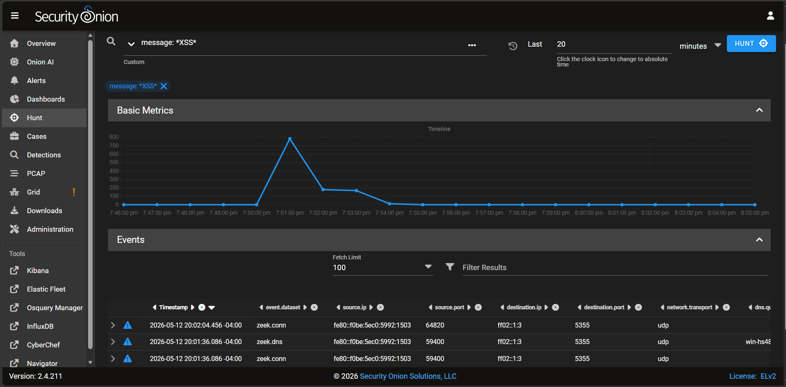
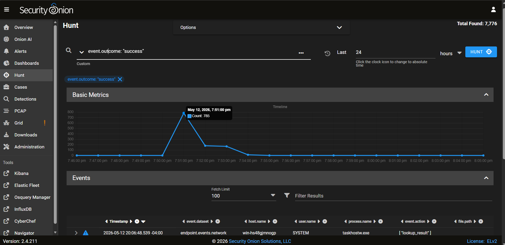

# Web Application Security: SafeLine WAF Deployment and SIEM Integration

This project was completed in an isolated web security lab built for WAF testing, log review, and SIEM detection practice.

---

## Project Overview

This project focuses on protecting a vulnerable web application with SafeLine WAF and reviewing the security telemetry created during web attack testing.

I deployed DVWA as the vulnerable application, placed SafeLine WAF in front of the application path, reviewed WAF and syslog activity, queried SafeLine attack records from its PostgreSQL container, and created an Elastic detection rule for selected SafeLine attack-type codes.

The goal was not just to run web attacks. The goal was to understand how web attack activity appears across different visibility points:

1. DVWA application access
2. SafeLine WAF traffic and attack records
3. Syslog events received by Security Onion
4. Elastic detection logic
5. Security Onion hunt results
6. Rate-limiting behavior during high-volume traffic

The project also included OWASP ZAP testing and SafeLine rate-limiting review to observe how the lab handled higher-volume web traffic.

---

## Why I Built This Project

Web application attacks are common, but the important defensive skill is understanding how the activity appears in logs and security tools.

I built this lab to practice:

1. Deploying a vulnerable web application behind a WAF.
2. Validating that normal application access still worked.
3. Reviewing WAF-generated attack records.
4. Sending and reviewing syslog data in Security Onion.
5. Creating an Elastic rule based on observed WAF attack-type codes.
6. Comparing WAF visibility with Security Onion hunt results.
7. Reviewing rate-limiting behavior during repeated web requests.

This project helped me understand that WAF testing is not only about whether an attack is blocked. It is also about whether the security team can see the activity, query it, interpret it, and build useful detection logic from it.

---

## Lab Environment & Architecture

## Architecture

```mermaid
graph TD
    A[Attack Simulation] --> B[Credential Access]
    B --> C[Golden Ticket Creation]
    C --> D[Authentication Bypass]
    D --> E[Privileged Access]
    E --> F[Detection & Investigation]
    F --> G[Remediation]
    
    H[Windows Server 2022 DC] --> I[Active Directory]
    I --> J[Kerberos Authentication]
    J --> K[SIEM Integration]
    
    L[Forensic Tools] --> M[FTK Imager]
    L --> N[Volatility 3]
    L --> O[DB Browser for SQLite]
    
    P[Defender Perspective] --> Q[Event Log Analysis]
    P --> R[Memory Forensics]
    P --> S[Browser Artifact Review]
```eql

*Note: This diagram represents the lab environment and investigation workflow.*

| Component | Details |
|---|---|
| Attacker / Test Host | Kali Linux |
| Vulnerable Application | DVWA |
| WAF | SafeLine WAF Community Edition |
| SIEM / Log Review | Security Onion |
| Detection Review | Elastic / Kibana |
| Network IDS Visibility | Suricata / Security Onion Hunt |
| Web Testing Tool | OWASP ZAP |
| Container Access | Docker / PostgreSQL query through `docker exec` |

---

## Tools & Technologies Used

| Tool | Purpose |
|---|---|
| DVWA | Vulnerable web application used for testing |
| SafeLine WAF | Protected the web application path and recorded attack activity |
| Security Onion | Reviewed syslog and network security telemetry |
| Elastic / Kibana | Created and reviewed the detection rule |
| PostgreSQL | Stored SafeLine attack records |
| Docker | Provided access to the SafeLine PostgreSQL container |
| OWASP ZAP | Generated automated web testing traffic |
| Suricata | Provided network-layer alert visibility in Security Onion |

---

## Project Flow

The project followed this sequence:

1. Confirmed SafeLine WAF was active.
2. Confirmed DVWA was reachable.
3. Validated DVWA access through the SafeLine-protected path.
4. Reviewed SafeLine syslog forwarding configuration.
5. Confirmed Security Onion received syslog events.
6. Queried SafeLine PostgreSQL attack records using `docker exec`.
7. Created an Elastic rule for selected SafeLine attack-type codes.
8. Ran OWASP ZAP testing against the web application path.
9. Reviewed SafeLine rate-limiting behavior.
10. Queried Security Onion for XSS-related network activity.
11. Reviewed successful event activity in Security Onion.

---

## Phase 1: SafeLine WAF and DVWA Access

SafeLine WAF was active in the lab environment.

![Lab Screenshot](screenshots/01_SafeLine_WAF_Dashboard_Active.png)

## What this proved

This confirmed that the SafeLine WAF dashboard was reachable and the WAF service was running.

The dashboard alone does not prove blocking or detection. It only confirms that SafeLine was active and available for configuration and review.

---

DVWA was also reachable in the lab.

![Lab Screenshot](screenshots/02_DVWA_Login_Success.png)

## What this proved

This confirmed that the vulnerable web application was accessible and ready for testing.

DVWA was used as the intentionally vulnerable application for web security validation.

---

DVWA access was also validated through the SafeLine-protected path.

![Lab Screenshot](screenshots/03_DVWA_Protected_via_SafeLine_WAF.png)

## What this proved

This confirmed that DVWA could be reached through the SafeLine-facing application path.

This matters because a WAF should still allow legitimate application traffic while inspecting or blocking suspicious requests.

---

## Phase 2: Syslog Forwarding and SIEM Reception

SafeLine-related logging was configured to forward syslog data toward the SIEM.

![Lab Screenshot](screenshots/04_SafeLine_Syslog_Configuration.png)

## What this proved

This screenshot shows Nginx logging configured to send syslog data to a remote destination.

The visible configuration includes syslog forwarding to:

`192.168.9.131:514`

This supports the claim that syslog forwarding was configured. It does not prove full WAF payload visibility by itself.

---

Security Onion showed received syslog events.

![Lab Screenshot](screenshots/05_Security_Onion_Syslog_Reception.png)

## What this proved

Security Onion showed `syslog.syslog` events in the Hunt interface.

This confirmed that syslog data was being received and indexed. The screenshot supports syslog reception, not complete parsing of every WAF field.

---

## Phase 3: SafeLine Attack Record Review

SafeLine attack records were queried directly from the PostgreSQL container.

![Lab Screenshot](screenshots/06_SafeLine_Attack_Codes_Extraction.png)

## Query Reviewed

```sql
SELECT attack_type, src_ip, url_path
FROM public.mgt_detect_log_basic
ORDER BY id DESC
LIMIT 4;
```

## What this proved

The query returned SafeLine attack records containing:

- `attack_type`
- `src_ip`
- `url_path`

The visible attack-type values included:

- `0`
- `1`
- `9`
- `11`

The source IP shown was:

`192.168.9.136`

The URL paths included suspicious web payload patterns such as encoded traversal, script tags, and password-file access attempts.

This supports the claim that SafeLine stored useful attack metadata in its PostgreSQL database. It should not be overstated as proof of full payload visibility or complete SIEM parsing.

---

## Phase 4: Elastic Detection Rule Configuration

An Elastic detection rule was configured to match selected SafeLine attack-type codes in log messages.



## Rule Logic

The custom query matched these message patterns:

```kql
message: "attack_type: 0" OR
message: "attack_type: 1" OR
message: "attack_type: 9" OR
message: "attack_type: 11"
```

## What this proved

This screenshot confirmed that an Elastic rule was created to search for selected SafeLine attack-type codes.

The rule description mapped the selected codes to common web attack categories such as:

- SQL injection
- Cross-site scripting
- Command injection
- Local file inclusion

The rule was configured as a query rule with a critical severity and a five-minute schedule.

This supports custom detection logic based on observed SafeLine log content. It should not be described as a complete web application attack detection system.

---

## Phase 5: OWASP ZAP Web Testing

OWASP ZAP was used to generate automated web testing traffic against the SafeLine-facing application path.



## What this proved

The screenshot shows a completed ZAP automated scan against:

`http://192.168.9.136`

The scan generated:

- 1,913 requests
- 88 alerts

This supports that ZAP generated significant web testing traffic against the application path.

The screenshot does not prove that the Kali VM froze or that every ZAP finding was validated manually, so those claims should not be made in the public documentation.

---

## Phase 6: SafeLine Rate-Limiting Review

SafeLine rate-limiting behavior was reviewed after repeated web requests.



## What this proved

The SafeLine rate-limiting page showed entries for:

`192.168.9.136`

The reason shown was:

`3 Reqs within 10 seconds, Basic Access Limit was triggered`

The action shown was:

`Block 1 minutes`

This confirmed that SafeLine rate limiting triggered in the lab and blocked requests after the configured request threshold was reached.

The evidence supports rate-limiting behavior in this lab. It should not be described as guaranteed DDoS protection or production-grade bot mitigation.

---

## Phase 7: Security Onion XSS-Related Hunt Review

Security Onion Hunt was used to search for XSS-related activity.



## What this proved

The Hunt query searched for:

```text
message: *XSS*
```

The screenshot showed XSS-related activity over the selected time window.

This provided a network/security-monitoring view alongside the WAF records.

The screenshot supports XSS-related hunt visibility. It should not be overstated as proof that Suricata fully detected every web attack tested.

---

## Phase 8: HTTP Success Event Review

Security Onion Hunt was also used to review successful event activity.



## What this proved

The Hunt query searched for:

```text
event.outcome: "success"
```

The screenshot showed successful events over the selected time window, including a visible spike around the testing period.

This supported review of allowed or successful activity alongside blocked or suspicious activity.

The screenshot does not prove perfect 200/403 response-code correlation by itself, so the claim should stay limited to successful event visibility.

---

## Detection Logic Explained

The Elastic rule was based on matching SafeLine attack-type codes in log messages.

### 1. WAF attack record visibility

SafeLine stored attack-related records in PostgreSQL, including attack type, source IP, and URL path.

### 2. Syslog and SIEM visibility

Security Onion received syslog events, confirming that log data was reaching the SIEM environment.

### 3. Elastic query logic

Elastic was configured to search for selected SafeLine attack-type codes in message fields.

### 4. Supporting network visibility

Security Onion Hunt was used to review XSS-related activity and successful event activity as supporting context.

This created a basic lab workflow for reviewing web attack activity from multiple visibility points.

---

## Key Findings & Analysis

### 1. DVWA was reachable through the lab web path

DVWA access was validated, including access through the SafeLine-facing path.

### 2. SafeLine generated useful attack records

The PostgreSQL query showed attack-type codes, source IPs, and URL paths from SafeLine records.

### 3. Security Onion received syslog events

The Security Onion Hunt view showed syslog events being received and indexed.

### 4. Elastic detection logic was created from observed WAF records

The custom rule matched selected SafeLine attack-type codes in log messages.

### 5. ZAP generated high-volume testing traffic

ZAP produced a large number of requests and findings, which helped generate web testing activity for review.

### 6. SafeLine rate limiting triggered during testing

SafeLine showed rate-limit entries after repeated requests from the test source.

### 7. Security Onion provided supporting hunt visibility

Security Onion Hunt queries showed XSS-related activity and successful event activity during the testing period.

---

## Limitations

This was a controlled home lab, not a production WAF deployment.

Important limitations:

- DVWA is intentionally vulnerable and was used only for authorized lab testing.
- The screenshots support SafeLine attack metadata review, not full payload visibility across all traffic.
- The syslog screenshot supports event reception, not complete field parsing.
- The Elastic rule was based on selected SafeLine attack-type codes and message matching.
- The rule should not be treated as universal web attack detection.
- The ZAP screenshot shows completed automated testing, but individual findings were not all manually validated in the screenshots.
- The rate-limiting screenshot supports blocking behavior for repeated requests, not full DDoS defense.
- The XSS hunt screenshot supports XSS-related search visibility, not complete Suricata coverage for every attack type.
- A production version would need stronger parsing, field extraction, normalization, tuning, and alert validation.

---

## Improvements for a Future Version

If I expanded this project, I would improve it by:

- Exporting or documenting the exact log forwarding pipeline more clearly.
- Normalizing SafeLine attack fields into structured Elastic fields instead of relying on message text.
- Saving the Elastic rule export alongside the README.
- Capturing alert results generated by the custom Elastic rule.
- Capturing clearer before-and-after examples of allowed versus blocked HTTP responses.
- Testing each attack type separately and documenting the matching SafeLine attack code.
- Adding packet-level evidence for selected web attacks.
- Tuning the rule to reduce false positives before treating it as production-ready.
- Adding a timeline that maps each test action to SafeLine, Security Onion, and Elastic evidence.

---

## Screenshot Evidence

| Screenshot | What It Shows |
|---|---|
| `screenshots/01_SafeLine_WAF_Dashboard_Active.png` | SafeLine WAF dashboard active |
| `screenshots/02_DVWA_Login_Success.png` | DVWA application reachable in the lab |
| `screenshots/03_DVWA_Protected_via_SafeLine_WAF.png` | DVWA reachable through the SafeLine-facing path |
| `screenshots/04_SafeLine_Syslog_Configuration.png` | Syslog forwarding configured in Nginx logging |
| `screenshots/05_Security_Onion_Syslog_Reception.png` | Security Onion receiving syslog events |
| `screenshots/06_SafeLine_Attack_Codes_Extraction.png` | PostgreSQL query returning SafeLine attack records |
| `screenshots/07_Elastic_Detection_Rule_Configuration.png` | Elastic rule matching selected SafeLine attack-type codes |
| `screenshots/08a_ZAP_Fuzzer_Traffic.png` | OWASP ZAP automated scan traffic completed |
| `screenshots/08b_WAF_Rate_Limiting_Backend.png` | SafeLine rate-limiting entries and block action |
| `screenshots/09_Suricata_XSS_Alert.png` | Security Onion Hunt query for XSS-related activity |
| `screenshots/10_HTTP_Success_Validation.png` | Security Onion Hunt query for successful event activity |

---

## Repository Information

**Project**: WAF-Deployment-SIEM-Integration
**Author**: Dmokom1  
**Purpose**: Hands-on cybersecurity lab for skill development
**Environment**: Isolated home lab with Windows Server 2022 DC
**Tools**: See "Tools Used" section above

### Usage Notes:
- This repository documents a learning exercise, not production code
- All screenshots are from controlled lab environments
- Techniques demonstrated are for educational purposes only
- Always follow organizational policies and legal guidelines

### Contributing:
While this is primarily a personal learning portfolio, suggestions and feedback are welcome. Please open an issue to discuss improvements.

