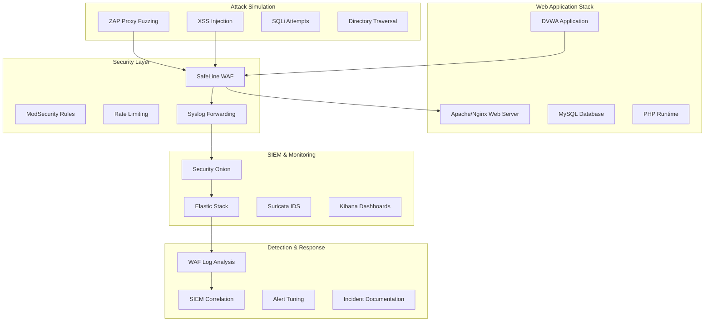

# WAF Deployment & SIEM Integration Architecture

```mermaid
graph TB
    subgraph "Web Application Stack"
        A1[DVWA Application]
        A2[Apache/Nginx Web Server]
        A3[MySQL Database]
        A4[PHP Runtime]
    end
    
    subgraph "Security Layer"
        B1[SafeLine WAF]
        B2[ModSecurity Rules]
        B3[Rate Limiting]
        B4[Syslog Forwarding]
    end
    
    subgraph "Attack Simulation"
        C1[ZAP Proxy Fuzzing]
        C2[XSS Injection]
        C3[SQLi Attempts]
        C4[Directory Traversal]
    end
    
    subgraph "SIEM & Monitoring"
        D1[Security Onion]
        D2[Elastic Stack]
        D3[Suricata IDS]
        D4[Kibana Dashboards]
    end
    
    subgraph "Detection & Response"
        E1[WAF Log Analysis]
        E2[SIEM Correlation]
        E3[Alert Tuning]
        E4[Incident Documentation]
    end
    
    A1 --> B1
    B1 --> A2
    C1 --> B1
    C2 --> B1
    B1 --> B4
    B4 --> D1
    D1 --> D2
    D2 --> E1
    E1 --> E2
```
